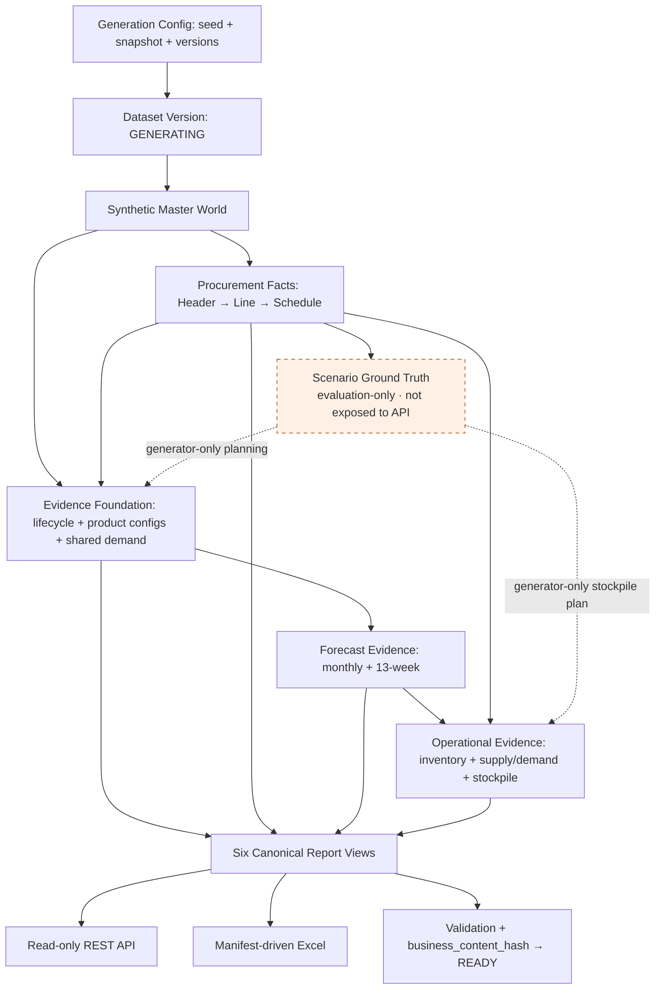

# Overdue PO Copilot

A synthetic procurement data platform and future AI copilot for overdue purchase-order diagnosis and decision support.

采购订单超期排查需要把订单、历史预测、库存、项目生命周期和囤料计划放在同一时间线上。
System A 用可重复的合成业务世界提供这套证据基础；System B 已建立 REST 适配、标准模型、确定性指标与参数化业务诊断。六个判断分支在证据和显式Policy完整时覆盖原五类原因；决策支持仍留后续阶段。

**System A: COMPLETE · System B: Phase 2C — parameterized deterministic diagnosis · Synthetic data only.**

正式运行仅需公开 Python 依赖与 PostgreSQL；Excel 使用 openpyxl，不需要 Node.js、
Codex 或私有运行时。安装、六表导出与验证步骤见[本地运行手册](docs/LOCAL_SETUP.md)。

## Why this project

真实企业数据通常分散在多个系统中，且不能作为公开演示数据。独立随机生成六张报表又会造成跨表数量、版本和项目关系矛盾。
本项目先生成统一的 Synthetic Enterprise World，再派生规范化事实、六张报表、API 和 Excel。
这样可以在不使用真实企业记录的前提下，测试时间口径、数据血缘、权限与未来诊断逻辑。

## Architecture



运行时数据流固定为 normalized platform facts → canonical reporting views → API / Excel。
公开查询不会读取隐藏答案，也不会重新实现报表业务公式。

## System A — Mock Enterprise Data Platform

- seed、固定 `snapshot_date`、生成器版本和配置决定合成世界；稳定 UUID 与内容 hash 支持复现。
- PostgreSQL dataset-scoped 复合外键和有效日期约束保证跨 Dataset 隔离及时间关系一致。
- Alembic migrations 001–011 建立主数据、采购事实、历史证据与 reporting views；012 补充只读证据视图。
- 每个生成阶段使用事务；缺失/部分前置世界拒绝生成，不静默补齐。
- Finalization 校验一致性并写入最终 hash，原子切换 `GENERATING → READY`。
- READY 在 Generator 服务入口拒绝改写，重新 finalization 检测内容变化；这不是对 owner 直接 SQL 的数据库级不可变锁。

## Six Business Reports

| Report | Purpose | Grain | Main role |
|---|---|---|---|
| 1 — Overdue PO Detail | 展示严格超期的 PO 与未交数量 | PO Header × Line × Schedule/Shipment | 排查入口 |
| 2 — Material Supply-Demand | 汇总供应、实际需求和盈余 | 每 Material 一行，V1 主库存组织 | 供需背景 |
| 3 — Historical Forecast | 展示 Anchor 前后预测证据 | Schedule × Material × Project × Version × Month（API 长表） | 需求变化分析输入 |
| 4 — Latest 13-Week Forecast | 展示最新 13 周需求，保留零需求物料 | 每 Material 一行，13 个周槽位 | 未来消耗输入 |
| 5 — Product Configuration | 展示配置物料与项目生命周期 | 有效 Product Config × Material | 项目/配置证据 |
| 6 — Stockpile Detail | 展示 snapshot 时有效的当前囤料计划 | 最新有效 Stockpile Version × Material | 囤料证据；历史 as-of 查询另按 PO order date |

六个最终 Excel 的列数为 **37 / 106 / 23 / 44 / 22 / 60**。
列序与多级表头只有一份[机器 Manifest](backend/app/reporting/report_header_manifest.json)，
[字段映射](docs/REPORT_FIELD_MAPPING.md)说明各列来源，不在 API、View 和 exporter 分别维护列序。

## Data Consistency / Ground Truth

Ground Truth 是合成场景的预期答案，只存在于隔离的 `evaluation` schema，供 Generator/Evaluation/测试使用。
Cause-first 生成让业务证据与测试目标一致；生产式 API 使用 `system_a_api`，不能读取 Truth 或受限 raw tables。

Report 3、4、6 的预测都来自同一 Underlying Demand Signal 和持续生效的日期修订。
Report 2 供应与采购开放量、库存组件对账；Stockpile 的月预测保留同源 lineage。
所有“当前”都使用 Dataset snapshot，不使用机器日期；同日版本取最大有效 sequence。

辅助字段中尚未确认的公式保持 null；`KD` 仅作辅助展示、释义待确认，
售后正式处置规则仍待业务确认。System A 不把这些空缺编造成诊断结论。

## Tech Stack

Python 3.12（已验证）、FastAPI、Pydantic、SQLAlchemy 2、PostgreSQL 16、Alembic、
pytest、NumPy/SciPy；精确版本在 [requirements.txt](backend/requirements.txt)。
Excel 使用公开依赖 [openpyxl 3.1.5](https://pypi.org/project/openpyxl/3.1.5/)，与其余 Python 依赖一起安装。
Docker Compose 用于本地 PostgreSQL。仓库的 Next.js 页面只是初始占位，不是业务 Dashboard。

## Quick Start

使用 Windows PowerShell，从仓库根目录开始。需要 Python 3.12 与运行中的 Docker Desktop，
不需要连接真实企业系统。

1. 按[本地运行手册](docs/LOCAL_SETUP.md)准备 `.env`、PostgreSQL 角色/密码与测试数据库。
2. 安装 `backend/requirements.txt`，执行 Alembic upgrade 和 grants bootstrap。
3. 顺序运行 Master → Procurement → Scenario → Evidence → Forecast → Operational CLI。
4. 执行 finalization，然后在 `backend/` 启动 API：

```powershell
python -m app.finalization.cli --dataset-version-name demo-master-v1
python -m uvicorn app.main:app --host 127.0.0.1 --port 8000
```

上述 `python` 指已激活的 backend venv；手册给出无需激活的完整 PowerShell 命令。
推荐使用 `docker-compose.dev.yml` 仅启动 PostgreSQL。
根目录 `docker-compose.yml` 是早期三服务骨架，尚未配置容器 API 数据库连接，不能当作完整启动命令。
不要对已发布 READY Dataset 重跑生成步骤，也不要对开发数据库执行测试重建。

## API Examples

API 默认只选择最新 READY Dataset；没有 READY 返回 `NO_READY_DATASET`（404）。
可以显式指定 `dataset_version_name` 或 `dataset_version_id`，包含开发用 GENERATING Dataset。
分页默认为 1/100，page_size 上限 500。Dataset 列表会展示各状态的安全元数据。

```powershell
Invoke-RestMethod "http://localhost:8000/api/v1/datasets"
Invoke-RestMethod "http://localhost:8000/api/v1/reports/overdue-pos?dataset_version_name=demo-master-v1&page_size=2"
Invoke-RestMethod "http://localhost:8000/api/v1/reports/latest-13w-forecast?page_size=2"
```

报表分页结构示意（空 items 仅省略行内容）：

```json
{
  "dataset_version_id": "1d533913-115a-5f95-a865-374640fb05fc",
  "snapshot_date": "2026-08-26",
  "page": 1,
  "page_size": 2,
  "total": 115,
  "items": []
}
```

交互接口文档：`http://localhost:8000/docs`；完整路径与筛选参数以 `/openapi.json` 为准。
六个 GET 路径：`overdue-pos`、`material-supply-demand`、`forecast-history`、
`latest-13w-forecast`、`product-configurations`、`stockpile`。
`/health` 检查进程；`/ready` 检查数据库连接和 migration head，不等于 Dataset 已 READY。
当前没有用户认证层，仅用于本机合成数据演示，不应直接暴露到公网。

## Excel Export

安装 `backend/requirements.txt` 后，在 `backend/` 执行：

```powershell
python -m app.reporting.export_cli --dataset-version-name demo-master-v1 --report all --output-dir ../exports
```

生成六个 `.xlsx`；Report 3 按 Forecast Version 分 Sheet 展开版本月起 7 个月，
Report 4 展开 Monday-start 的 13 周，Report 6 展开版本月之后 6 个自然月。
`exports/` 默认忽略，不提交正式导出文件。模板来源已固化成 Manifest，运行时不需要原始 Excel。

无需 npm、Node、Microsoft Excel 或私有运行时。Exporter 只负责列序、透视、动态表头和格式，
继续从 canonical views 读取业务值；未确认字段保留 blank/null。
重复导出的单元格值及行列顺序一致，不要求包含时间戳的 xlsx 二进制完全一致。
可按[干净环境 smoke 流程](docs/LOCAL_SETUP.md#clean-environment-smoke)重新安装公开依赖后导出六张表。

## Testing

公开可复现性修复后的最终单次全量回归，在干净公开依赖环境中执行：
**471 passed / 0 failed / 0 skipped**，844.98 秒，1 条既有 Starlette/httpx 弃用警告。
完整记录与六表 smoke 见[公开复现验收](docs/PUBLIC_REPRODUCIBILITY.md)。

Phase 6B checkpoint `a968492` 的最后一次全量记录：
**439 passed / 0 failed / 0 skipped**，810.33 秒，1 条既有 Starlette/httpx 弃用警告。
该 439 项结果仅为历史 checkpoint 记录。

覆盖 schema/migrations、确定性、Dataset 隔离、业务规则、Forecast 选择、
跨报表对账、权限、API、Excel 和 finalization。Final Review 新增真实 API 角色端到端覆盖，
修复 Report 6 raw-table 越界读取；历史 targeted 结果见[审查记录](docs/FINAL_REVIEW.md)。
现有 Excel 集成测试直接使用 openpyxl 导出并重开文件，覆盖全部业务值、精确表头、格式、
零/空值及重复导出确定性，不调用私有工具验收。

```powershell
# 在 backend/；完整测试另需手册中的 TEST_* 连接
python -m pytest
python ../scripts/check_forbidden_terms.py
```

集成测试只允许数据库名含 `test` 的专用数据库，会执行 `downgrade base → upgrade head`。
不要指向开发/共享数据库。未配置测试连接时出现 skipped，不可据此声称完整验收通过。

## Repository Structure

```text
backend/
  app/generators/       deterministic world generation
  app/domain/          shared business calculations
  app/reporting/       canonical views, manifest, Excel
  app/api/             read-only dataset/report/health routes
  app/finalization/    private publication CLI/service
  app/system_b/        canonical models, adapter, analytics, diagnosis foundation
  alembic/versions/    migrations 001–012; 012 adds read-only evidence views
  db/bootstrap/        roles and grants
  tests/               unit and PostgreSQL integration tests
docs/                  contracts, architecture, setup and review
examples/              small synthetic aggregate checkpoint summaries
scripts/               forbidden-term checks
frontend/              initial placeholder only
agent/                 reserved directories only
data/                  placeholders; local generated data is ignored
```

保留工程代码、migration、测试、Manifest、规格与小型聚合示例。
`.env`、数据卷、venv、node_modules、缓存、日志、备份和导出均不属于公开内容。
原始 Word/Excel 不随仓库分发，也不作为业务数据源。
`examples/*_summary.json` 是各阶段历史快照；最终 READY 状态见
[system_a_final_summary.json](examples/system_a_final_summary.json)。

## System Status

| Component | Status |
|---|---|
| System A — Mock Enterprise Data Platform | COMPLETE；Final Review 补齐 Report 6 真实角色兼容修复 |
| Demo Dataset | READY |
| Schema head | `012_evidence_contract`；部署需upgrade head，既有dataset生成元数据不改写 |
| System B | Phase 2C：六个参数化诊断分支、证据/参数trace已实现；缺参/缺证据未决，决策/Agent/业务前端未实现 |
| Public runtime | Python requirements + PostgreSQL；Excel 已替换为公开 openpyxl |

最终业务 hash：
`f91717e3af70a518caf31673fd5f733f1e12b2dfb9598b1e7c0cec20c36ac199`。
本次 Excel 可移植性修复不修改 Dataset facts、Truth、业务阈值或历史 migration。

## Roadmap — System B

已完成 Phase 0 + Phase 1A：独立 `backend/app/system_b/` 命名空间中的
Canonical Models 与 System A HTTP Adapter，复用现有 Settings、httpx、pytest，无新增依赖。
通过 `.env.example` 的 `SYSTEM_A_BASE_URL`（包含 API 前缀）和
`SYSTEM_A_TIMEOUT_SECONDS` 配置访问；不直接读取 System A 数据库。

参见 [System B 架构与调用示例](docs/system-b-architecture.md)、
[实际 REST 字段映射与缺口](docs/data-contracts.md)、
[分层设计 ADR](docs/adr/0001-system-b-layer-boundaries.md)。
运行 `python -m pytest tests/test_system_b_adapter.py` 可在 backend 目录无服务、无数据库测试 Adapter。

Phase 1C已补充稳定身份、Forecast版本序号/窗口、周日期/项目周贡献与历史囤料as-of/version查询。
仍缺PO单价/币种、完整Forecast版本目录与供应承诺口径；缺失值不推算、不伪造。
Phase 1B 已增加纯 Analytics 与薄服务：年龄/阈值、13周聚合、物料消耗、源供需盈余、库存覆盖，
以及仅在稳定身份和时间范围可核验时可用的显式同月 Forecast 比较。
已有PO跨记录消耗可使用新增稳定ID；自动版本选择和Top 3算法未开发，confirmed/planned供应口径与金额仍blocked。
详见 [Analytics 指标与可用性](docs/analytics-metrics.md) 及 [证据契约](docs/evidence-contracts.md)。
运行 `python -m pytest tests/test_system_b_analytics.py -q` 验证纯计算，无网络/数据库依赖。
Phase 2A增加 [Diagnosis Foundation](docs/diagnosis-engine.md)：统一Evidence Bundle、字段provenance、三态规则接口与确定性trace。
原foundation入口只实现超期阈值资格、历史囤料记录存在和可比较Forecast负向变化三个支持规则，`primary_reason`始终为空。
当前lifecycle不能替代下单日历史lifecycle，参考项目/最大贡献项目不自动成为责任项目。
运行 `python -m pytest tests/test_system_b_diagnosis.py -q` 验证固定证据下的纯规则；无网络或数据库依赖。
Phase 2B新增`diagnose_business`入口：满足LT+240严格超期、稳定身份完整且R1组织为TRIAL时，输出唯一TRIAL主原因及组织/aging来源。
按 [正式规则审计与规范](docs/diagnosis-rule-specification.md) 固定业务优先级；量产不是第六类原因，NPI/EOL不自动决定试产或售后。
Phase 2B当时未完成的五个分支已在Phase 2C补齐：变化幅度、后移、售后持续性及有效标签均来自调用者版本化Policy，不继承Generator的Synthetic阈值。
运行 `python -m pytest tests/test_system_b_business_diagnosis.py -q` 验证Golden scenarios、排除条件、policy与确定性。
Phase 2C新增中性项目贡献ranking/唯一top、完整R3 Anchor窗口的共同月份比较和后移匹配量；并列、全零、缺月份或项目lifecycle不对应均保持未决。
`diagnose_business(bundle, policy)`可输出TRIAL、DEMAND_ADJUSTMENT、AFTER_SALES、STOCKPILE以及客户/内部两个PROJECT_OBSOLESCENCE分支。
内部呆滞仅在所有高优先级分支均明确排除后成立；缺Policy不是false。规则、参数全文/版本/fingerprint和事实来源均可追溯。
本轮售后为显式13周参数模式，不宣称企业阈值已确认或已验证6月模式；top contributing project不等于责任项目。
运行 `python -m pytest tests/test_system_b_diagnosis_completion.py -q` 验证六分支正反例、参数切换、并列和严格fallback。
Decision Engine、LangGraph Agent、Next.js Dashboard / Copilot 仍未实现；没有内置企业阈值或Demo profile。

## Disclaimer

**Synthetic data only.** 不包含真实公司订单、供应商交易、物料或项目记录；不能用于真实企业运营。
本项目展示确定性业务规则、合成企业数据、数据血缘和可测试 API 如何组成采购决策支持基础。
当前为本地演示工程，不宣称生产部署或认证安全能力。许可证：[MIT License](LICENSE)。
