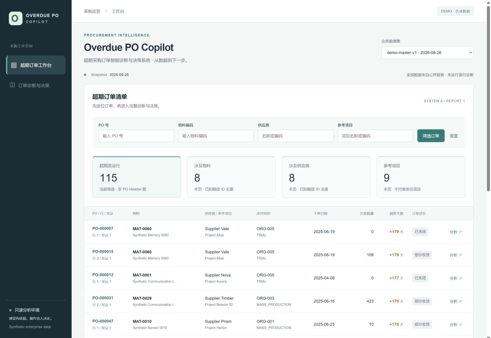
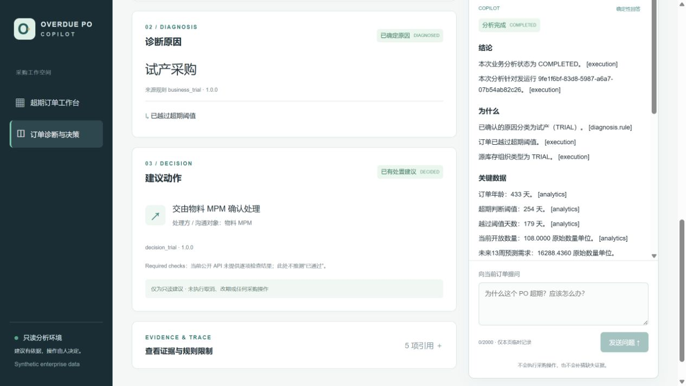
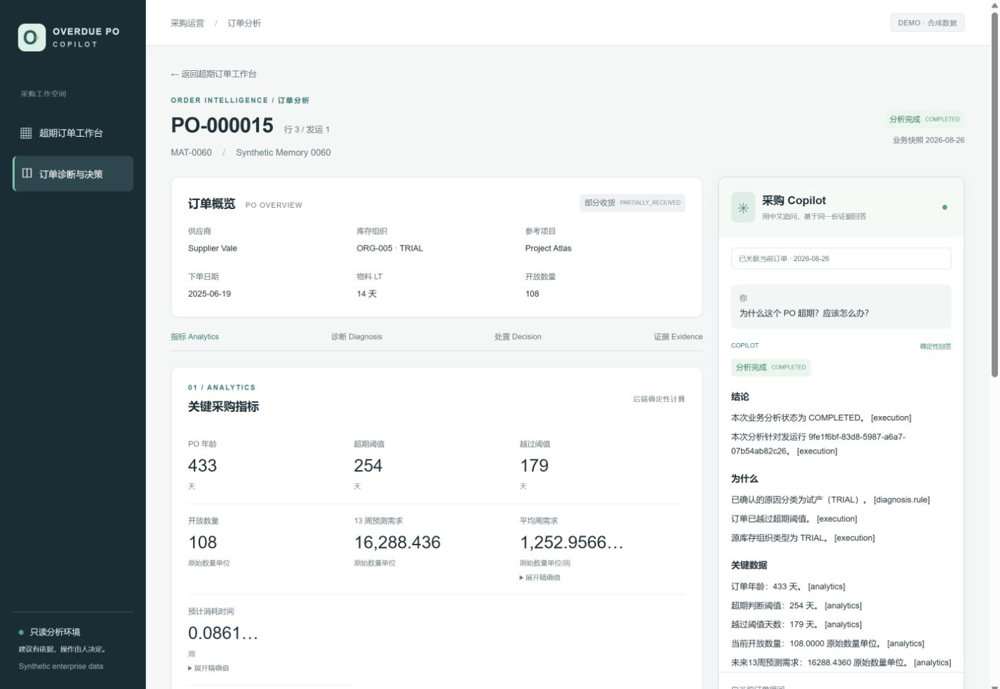
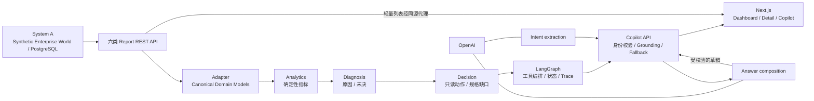

# Overdue PO Copilot

面向采购人员的超期采购订单诊断与决策支持系统：用确定性引擎计算和判断，用有证据约束的 Copilot 组织中文回答。

**v1.0 求职展示版 · Synthetic data only · Read-only · 本地演示**

> **Real OpenAI smoke not executed.** 本次封版进程未配置 OpenAI key/model。真实 REST、LangGraph、业务引擎和浏览器链路已通过 deterministic fallback 演示。模拟模型测试不是模型准确率，也不代表真实模型已验收。此版本标记不表示已创建 GitHub Release 或 tag。

## What it solves

超期 PO 不只是“找出老订单”。采购人员还需要把历史 Forecast、当前项目生命周期、供需、下单时囤料证据、项目贡献和消耗周期放在一致的身份与时间口径下，才能判断原因与处置路径。

本项目将问题拆成可检查的步骤：数据是否属于同一订单和快照 → 指标是多少 → 规则能否确定原因 → 正式规格允许什么动作 → 用中文解释证据。缺字段、缺参数、存在歧义或动作尚未确认时，明确保持未决。

真实 ERP、计划与 BI 系统无法作为公开求职数据源，所以 System A 先构建统一、可重复的合成企业世界，再派生六类报表、REST API 和 Excel。System B 通过 REST 集成，不读取隐藏答案或直接连接数据库。

## Product Screenshots

以下均为当前产品、真实公开 API 和 `demo-master-v1` 的浏览器截图，没有合成 UI 或预置前端答案。

### Dashboard



### PO Detail / Diagnosis / Decision



### Contextual Copilot



## Demo Flow

1. 打开 [本地工作台](http://localhost:3000)，选择 `demo-master-v1`，业务 snapshot 为 `2026-08-26`。
2. 点击 **PO-000015 / 行3 / 发运1**，查看开放量、433天订单年龄、254天阈值和179天越界。
3. 输入 **“为什么这个 PO 超期？应该怎么办？”**。
4. 查看 `TRIAL` 诊断及 `REQUEST_MPM_CONFIRMATION` / MPM，再展开 **Evidence & Trace** 核对规则、版本与快照。

无 key 时显示“确定性回答”。演示记录由公开 API 选取，ID 只用于文档指引，不硬编码在前端。可另看 `PO-000031 / 行2 / 发运1` 的未决状态，说明未知值和缺参数不会被包装成确定结论。

## Architecture



主链表示业务结果依赖；实际 LangGraph 依次调用 Context、Analytics、Diagnosis、Decision 四个工具。所有受支持意图目前都运行完整依赖链，未实现局部计算优化。OpenAI 不连接数据库或诊断规则。

[System B 架构](docs/system-b-architecture.md) · [Agent 架构](docs/agent-architecture.md) · [Copilot 契约](docs/copilot.md) · [前端设计](docs/frontend-mvp.md)

## Why not put business logic in the LLM?

采购核心规则需要确定、可测试、可追溯、可审计。模型只提取受控意图、提供有限路由输入，并从允许的表述中组织回答；确定性 Resolver 验证身份，应用控制工具调用。

回答校验要求 reason 来自 Diagnosis、action/owner 来自 Decision、数值来自 Analytics，引用存在且事实与限制完整。改数、捏造动作、替换角色或无依据措辞都会导致整份模型草稿被丢弃，回退到同一证据的确定性回答。v1.0 中文表述有意受限，不是任意自由生成。

## Key Features

- **一致的数据基础**：固定 seed/snapshot、稳定 UUID、dataset 隔离，Forecast 报表同源，隐藏真值与普通 API 分离。
- **六类业务报表**：超期 PO、物料供需、历史 Forecast、最新13周 Forecast、产品配置、囤料；Manifest 驱动 Excel 导出。
- **确定性 Analytics**：aging、消耗、可比 Forecast、项目贡献等，保留 Decimal 与可计算状态；前端只展示公开投影。
- **五类原因、六个判断分支**：TRIAL、DEMAND_ADJUSTMENT、AFTER_SALES、STOCKPILE、客户/内部两条 PROJECT_OBSOLESCENCE 路径。
- **独立 Decision**：按正式规则映射只读建议，不重判原因，不把未决当作默认动作。
- **可追溯 Copilot**：精确实体消歧、规则/版本引用、grounding 校验和模型失败安全回退。
- **中文产品界面**：数据集、筛选、分页、订单详情、临时聊天和证据展开；首页不逐行运行 Agent。

Dashboard 总数是超期**发运行**，不是去重 PO Header；其他 KPI 是**本页**已知 ID 去重，不冒充全数据集统计。无金额、savings、风险分数或虚构性能指标。

## Tech Stack

| Layer | Implemented stack |
|---|---|
| Backend | Python 3.12、FastAPI、Pydantic、SQLAlchemy 2、Decimal |
| Database | PostgreSQL 16、Alembic migrations 001–012、角色隔离 |
| Agent / LLM | LangGraph 1.2.11、官方 OpenAI SDK 3.6.0 / Responses Structured Outputs |
| Frontend | Next.js 16.3.1 App Router、React 19.2.8、TypeScript 5.9.3、普通 CSS |
| Testing | pytest、SDK模拟传输、Node test runner、React rendering tests、真实浏览器 smoke |
| Local deployment | Docker Compose 运行 PostgreSQL；System A/B 与 Next.js 单独启动 |

依赖以 [Python requirements](backend/requirements.txt) 和 [pnpm lockfile](frontend/pnpm-lock.yaml) 为准。前端已验证 Node 24 / pnpm 11.19.0，没有大型 UI/chart framework。

## Quick Start

使用 Windows PowerShell，克隆后从仓库根目录开始。需要 Python 3.12、Node 24、pnpm 11.19.0 和已启动的 Docker Desktop。

**首次初始化**：按 [本地环境手册第1–4节](docs/LOCAL_SETUP.md) 复制 `.env.example`、设置本地密码、启动 PostgreSQL、建立角色、安装 Python 依赖、执行已有 migration/grants，并按固定 seed 顺序生成与 finalization。预期为 migration `012_evidence_contract` 和 READY 的 `demo-master-v1`。不依赖私有 Word/Excel 或本机运行时，Excel 使用 openpyxl。

仅使用 `docker-compose.dev.yml` 的 PostgreSQL 服务。根目录 `docker-compose.yml` / Dockerfiles 为早期骨架，不是完整 v1.0 启动入口；本阶段未改造容器部署。不要对已有 READY dataset 重跑 Generator，不删除已有数据卷。

打开三个终端，**每个终端从仓库根目录开始**：

**1. System A**

```powershell
cd backend
& .\.venv\Scripts\python.exe -m alembic current
& .\.venv\Scripts\python.exe -m uvicorn app.main:app --host 127.0.0.1 --port 8000
```

**2. System B**

```powershell
cd backend
$env:SYSTEM_A_BASE_URL="http://127.0.0.1:8000/api/v1"
& .\.venv\Scripts\python.exe -m uvicorn app.system_b.copilot.api:app --host 127.0.0.1 --port 8100 --env-file ../.env
```

**3. Frontend**

```powershell
cd frontend
if (-not (Test-Path .env.local)) { Copy-Item .env.example .env.local }
pnpm install --frozen-lockfile
pnpm run build
pnpm start --hostname 127.0.0.1 --port 3000
```

打开 [http://localhost:3000](http://localhost:3000)。开发时可用 `pnpm dev`。重新 build 前先在自己的终端停止 Next.js；日志不要写到会被构建清理的 `.next` 目录。

## API / Environment

| Service / variable | Local value / meaning |
|---|---|
| System A | `http://127.0.0.1:8000/api/v1`；[Swagger](http://127.0.0.1:8000/docs) |
| System B | `POST http://127.0.0.1:8100/api/v1/copilot/query`；[Swagger](http://127.0.0.1:8100/docs) |
| Frontend | `http://localhost:3000` |
| SYSTEM_A_BASE_URL | B → A 的公开 REST 地址，包含 `/api/v1` |
| SYSTEM_A_API_BASE_URL / SYSTEM_B_API_BASE_URL | Next.js 服务器代理目标，见 `frontend/.env.example` |
| OPENAI_API_KEY | 可选，仅服务器进程使用；不提交、不进入客户端或日志 |
| OPENAI_MODEL | 使用模型时须显式指定，没有默认模型；本轮未配置 |
| OPENAI_TEMPERATURE | 默认0；模型不支持时设为 `null` 省略 |
| COPILOT_DIAGNOSIS_POLICY / COPILOT_DECISION_POLICY | 可信服务器配置，默认 null；缺参数保持未决，不注入测试阈值 |

Next.js 使用固定白名单同源代理，无须开放通配 CORS。浏览器没有 OpenAI SDK 或 key。API 使用 `system_a_api` 数据库角色，不为绕过权限错误改用 owner。

官方调用使用 strict schema 和 `store=False`，后者不等于供应商层面的零数据保留保证；见 [Structured Outputs](https://developers.openai.com/api/docs/guides/structured-outputs) 与 [Responses API](https://developers.openai.com/api/reference/python/resources/responses/methods/create)。仅发送本项目合成数据。完整选项见 [.env.example](.env.example) 和 [Copilot 文档](docs/copilot.md)。

## Testing

后端在 `backend` 执行，完整测试须先按 [本地手册第6节](docs/LOCAL_SETUP.md) 配置并加载专用 `TEST_DATABASE_URL` / `TEST_DATABASE_ADMIN_URL`。测试重建专用 test 数据库，不能指向开发库。

```powershell
python -m pytest -q
python -m pip check
python -m tests.release_evaluation
```

这里 `python` 指已激活的 backend venv，也可用手册中的显式 `.venv` 路径。默认完整 pytest 排除收费 `llm_integration`，不表示真实模型通过。

前端在 `frontend` 执行：

```powershell
pnpm run lint
pnpm run typecheck
pnpm run test
pnpm run build
```

本轮完整封版结果：

| Check | Result |
|---|---|
| Backend full pytest | **996 passed / 0 failed / 0 skipped / 1 deselected**（收费模型 opt-in） |
| Python dependency check | `pip check` 通过 |
| Frontend | lint、typecheck、production build通过；**13 passed / 0 failed / 0 skipped** |
| Release evaluation | **25/25**，已包含在996项内，不能重复相加 |
| Repository | hygiene、secret/local-path、generated garbage、diff检查通过；forbidden扫描281文件通过 |

执行边界和本地验证限制见 [封版验证记录](docs/release-verification.md)。

## Evaluation

[Evaluation 说明](docs/evaluation.md) 提供25个可重复执行用例和 JSON summary：4类意图路由、4类实体解析、7类业务场景、4类安全场景、6类 grounding 检查。真实引擎运行，模型输出为脚本模拟；每个用例重复两次验证确定性。

**25/25 是离线回归用例通过率，不是模型准确率。** Real OpenAI smoke not executed；未来应单独验证完整中文问法和 Analytics-only 问法，不把两条 smoke 外推为统计准确率。

## Known Limitations

- **PO price/currency** 缺失，不能计算超期金额，也不借囤料协议价推算。
- **ASN/PR confirmed supply** 的承诺、排重和组成契约未确定。`all_supply_qty` 仅表示源报表汇总，不冒充 confirmed/planned supply。
- **Historical lifecycle**：公开接口支持 snapshot 当前状态，不提供任意下单时点生命周期查询。
- **DC-16**：售后正式动作、保留量及保供周期尚未确认；不补造动作。零需求动作、持续消耗 owner 也保留规格缺口。
- 非试产业务需要显式、经确认的 Policy；测试参数不是部署默认值。Forecast 公开窗口不等于完整版本目录。
- Copilot 公开投影没有全部 Analytics 或逐项 required checks，UI 不补算。数量单位缺统一 UOM 转换；贡献项目不表示责任项目。
- 无 write-back、无 authentication、无 persistent memory；无邮件、供应商集成或自动取消/改期。
- 真实模型尚未验收；模型仅在既定事实表述内编排，不支持无限制自由回答。
- 仅本地演示。数据库 Compose 端口需防火墙保护，不要公开无认证的 A/B/前端端口。

## Repository Structure

```text
backend/
  app/                    System A 数据、报表、生成与 API
    system_b/             Adapter / Analytics / Diagnosis / Decision / Agent / Copilot
  alembic/                数据库 migrations
  db/bootstrap/           角色与授权
  tests/                  单元、契约、集成与离线发布评估
frontend/
  app/                    页面和固定目标代理
  components/             工作台、详情、证据、Copilot
  lib/                    API client、消费契约与展示
  tests/                  Node / React rendering tests
docs/                     规格、启动、评估、面试说明与真实截图
scripts/                  仓库检查与现有维护工具
examples/                 无逐条隐藏答案的公开示例
```

[30秒介绍与面试问答](docs/interview-guide.md) · [六报表字段映射](docs/REPORT_FIELD_MAPPING.md) · [数据契约](docs/data-contracts.md) · [公开环境复现记录](docs/PUBLIC_REPRODUCIBILITY.md)

## License

[MIT](LICENSE)。全部业务数据为合成数据，不包含真实企业订单或私有资料，不宣称线上客户、节省金额或生产部署能力。
