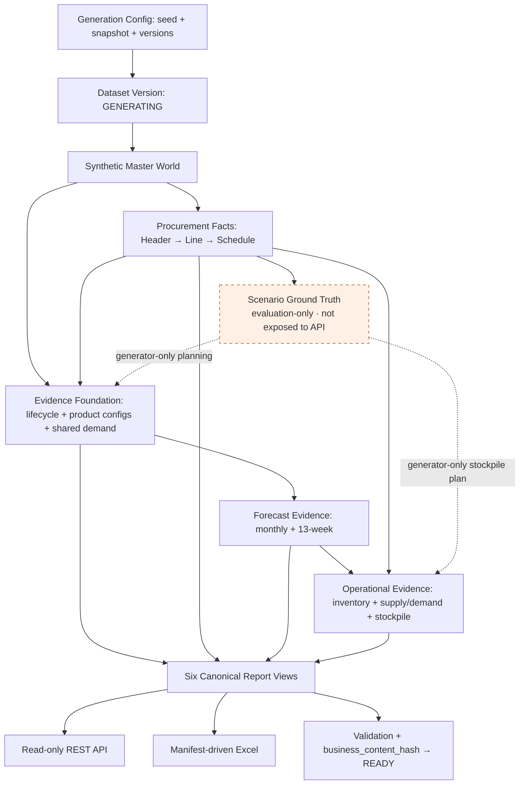

# Overdue PO Copilot

A synthetic procurement data platform and future AI copilot for overdue purchase-order diagnosis and decision support.

采购订单超期排查需要把订单、历史预测、库存、项目生命周期和囤料计划放在同一时间线上。
System A 用可重复的合成业务世界提供这套证据基础；未来 System B 将消费这些证据完成分析与决策支持。

**System A: COMPLETE · System B: NOT STARTED · Synthetic data only.**

> 公开复现限制：Excel 导出使用的 `@oai/artifact-tool` 需要已有获授权运行时，
> 目前不能从公共 npm registry 安装。API/数据库启动步骤与 Excel 前提分开说明；
> 完整的 GitHub 一键复现条件尚未满足，详见[最终审查](docs/FINAL_REVIEW.md)。

## Why this project

真实企业数据通常分散在多个系统中，且不能作为公开演示数据。独立随机生成六张报表又会造成跨表数量、版本和项目关系矛盾。
本项目先生成统一的 Synthetic Enterprise World，再派生规范化事实、六张报表、API 和 Excel。
这样可以在不使用真实企业记录的前提下，测试时间口径、数据血缘、权限与未来诊断逻辑。

## Architecture



运行时数据流固定为 normalized platform facts → canonical reporting views → API / Excel。
公开查询不会读取隐藏答案，也不会重新实现报表业务公式。

## System A — Mock Enterprise Data Platform

- seed、固定 `snapshot_date`、生成器版本和配置决定合成世界；稳定 UUID 与内容 hash 支持复现。
- PostgreSQL dataset-scoped 复合外键和有效日期约束保证跨 Dataset 隔离及时间关系一致。
- 11 个 Alembic migrations 建立主数据、采购事实、历史证据与 reporting views。
- 每个生成阶段使用事务；缺失/部分前置世界拒绝生成，不静默补齐。
- Finalization 校验一致性并写入最终 hash，原子切换 `GENERATING → READY`。
- READY 在 Generator 服务入口拒绝改写，重新 finalization 检测内容变化；这不是对 owner 直接 SQL 的数据库级不可变锁。

## Six Business Reports

| Report | Purpose | Grain | Main role |
|---|---|---|---|
| 1 — Overdue PO Detail | 展示严格超期的 PO 与未交数量 | PO Header × Line × Schedule/Shipment | 排查入口 |
| 2 — Material Supply-Demand | 汇总供应、实际需求和盈余 | 每 Material 一行，V1 主库存组织 | 供需背景 |
| 3 — Historical Forecast | 展示 Anchor 前后预测证据 | Schedule × Material × Project × Version × Month（API 长表） | 需求变化分析输入 |
| 4 — Latest 13-Week Forecast | 展示最新 13 周需求，保留零需求物料 | 每 Material 一行，13 个周槽位 | 未来消耗输入 |
| 5 — Product Configuration | 展示配置物料与项目生命周期 | 有效 Product Config × Material | 项目/配置证据 |
| 6 — Stockpile Detail | 展示 snapshot 时有效的当前囤料计划 | 最新有效 Stockpile Version × Material | 囤料证据；历史 as-of 查询另按 PO order date |

六个最终 Excel 的列数为 **37 / 106 / 23 / 44 / 22 / 60**。
列序与多级表头只有一份[机器 Manifest](backend/app/reporting/report_header_manifest.json)，
[字段映射](docs/REPORT_FIELD_MAPPING.md)说明各列来源，不在 API、View 和 exporter 分别维护列序。

## Data Consistency / Ground Truth

Ground Truth 是合成场景的预期答案，只存在于隔离的 `evaluation` schema，供 Generator/Evaluation/测试使用。
Cause-first 生成让业务证据与测试目标一致；生产式 API 使用 `system_a_api`，不能读取 Truth 或受限 raw tables。

Report 3、4、6 的预测都来自同一 Underlying Demand Signal 和持续生效的日期修订。
Report 2 供应与采购开放量、库存组件对账；Stockpile 的月预测保留同源 lineage。
所有“当前”都使用 Dataset snapshot，不使用机器日期；同日版本取最大有效 sequence。

辅助字段中尚未确认的公式保持 null；`KD` 仅作辅助展示、释义待确认，
售后正式处置规则仍待业务确认。System A 不把这些空缺编造成诊断结论。

## Tech Stack

Python 3.12（已验证）、FastAPI、Pydantic、SQLAlchemy 2、PostgreSQL 16、Alembic、
pytest、NumPy/SciPy；精确版本在 [requirements.txt](backend/requirements.txt)。
Excel exporter 调用 Node.js + `@oai/artifact-tool`；该私有依赖的公开分发/版本锁定尚未解决。
Docker Compose 用于本地 PostgreSQL。仓库的 Next.js 页面只是初始占位，不是业务 Dashboard。

## Quick Start

使用 Windows PowerShell，从仓库根目录开始。需要 Python 3.12 与运行中的 Docker Desktop，
不需要连接真实企业系统。

1. 按[本地运行手册](docs/LOCAL_SETUP.md)准备 `.env`、PostgreSQL 角色/密码与测试数据库。
2. 安装 `backend/requirements.txt`，执行 Alembic upgrade 和 grants bootstrap。
3. 顺序运行 Master → Procurement → Scenario → Evidence → Forecast → Operational CLI。
4. 执行 finalization，然后在 `backend/` 启动 API：

```powershell
python -m app.finalization.cli --dataset-version-name demo-master-v1
python -m uvicorn app.main:app --host 127.0.0.1 --port 8000
```

上述 `python` 指已激活的 backend venv；手册给出无需激活的完整 PowerShell 命令。
推荐使用 `docker-compose.dev.yml` 仅启动 PostgreSQL。
根目录 `docker-compose.yml` 是早期三服务骨架，尚未配置容器 API 数据库连接，不能当作完整启动命令。
不要对已发布 READY Dataset 重跑生成步骤，也不要对开发数据库执行测试重建。

## API Examples

API 默认只选择最新 READY Dataset；没有 READY 返回 `NO_READY_DATASET`（404）。
可以显式指定 `dataset_version_name` 或 `dataset_version_id`，包含开发用 GENERATING Dataset。
分页默认为 1/100，page_size 上限 500。Dataset 列表会展示各状态的安全元数据。

```powershell
Invoke-RestMethod "http://localhost:8000/api/v1/datasets"
Invoke-RestMethod "http://localhost:8000/api/v1/reports/overdue-pos?dataset_version_name=demo-master-v1&page_size=2"
Invoke-RestMethod "http://localhost:8000/api/v1/reports/latest-13w-forecast?page_size=2"
```

报表分页结构示意（空 items 仅省略行内容）：

```json
{
  "dataset_version_id": "1d533913-115a-5f95-a865-374640fb05fc",
  "snapshot_date": "2026-08-26",
  "page": 1,
  "page_size": 2,
  "total": 115,
  "items": []
}
```

交互接口文档：`http://localhost:8000/docs`；完整路径与筛选参数以 `/openapi.json` 为准。
六个 GET 路径：`overdue-pos`、`material-supply-demand`、`forecast-history`、
`latest-13w-forecast`、`product-configurations`、`stockpile`。
`/health` 检查进程；`/ready` 检查数据库连接和 migration head，不等于 Dataset 已 READY。
当前没有用户认证层，仅用于本机合成数据演示，不应直接暴露到公网。

## Excel Export

先完成[运行时配置](docs/LOCAL_SETUP.md#excel-runtime)，然后在 `backend/` 执行：

```powershell
python -m app.reporting.export_cli --dataset-version-name demo-master-v1 --report all --output-dir ../exports
```

生成六个 `.xlsx`；Report 3 按 Forecast Version 分 Sheet 展开版本月起 7 个月，
Report 4 展开 Monday-start 的 13 周，Report 6 展开版本月之后 6 个自然月。
`exports/` 默认忽略，不提交正式导出文件。模板来源已固化成 Manifest，运行时不需要原始 Excel。

**不要假定 `npm install` 可以完成安装。** 2026-08-30 公共 registry 检查返回 404；
已有获授权运行时可使用 `REPORT_EXPORT_NODE`、`REPORT_EXPORT_NODE_MODULES`。
未获此运行时的新用户目前不能复现 Excel 及完整 Excel 集成测试。

## Testing

Phase 6B checkpoint `a968492` 的最后一次全量记录：
**439 passed / 0 failed / 0 skipped**，810.33 秒，1 条既有 Starlette/httpx 弃用警告。
这是历史全量记录，不代表本次 Review 重跑了全部测试。

覆盖 schema/migrations、确定性、Dataset 隔离、业务规则、Forecast 选择、
跨报表对账、权限、API、Excel 和 finalization。Final Review 新增真实 API 角色端到端覆盖，
修复 Report 6 raw-table 越界读取；本轮 targeted 结果见[审查记录](docs/FINAL_REVIEW.md)。

```powershell
# 在 backend/；完整测试另需手册中的 TEST_* 连接与 Excel runtime
python -m pytest
python ../scripts/check_forbidden_terms.py
```

集成测试只允许数据库名含 `test` 的专用数据库，会执行 `downgrade base → upgrade head`。
不要指向开发/共享数据库。未配置测试连接时出现 skipped，不可据此声称完整验收通过。

## Repository Structure

```text
backend/
  app/generators/       deterministic world generation
  app/domain/          shared business calculations
  app/reporting/       canonical views, manifest, Excel
  app/api/             read-only dataset/report/health routes
  app/finalization/    private publication CLI/service
  alembic/versions/    immutable migration history 001–011
  db/bootstrap/        roles and grants
  tests/               unit and PostgreSQL integration tests
docs/                  contracts, architecture, setup and review
examples/              small synthetic aggregate checkpoint summaries
scripts/               forbidden-term checks
frontend/              initial placeholder only
agent/                 reserved directories only
data/                  placeholders; local generated data is ignored
```

保留工程代码、migration、测试、Manifest、规格与小型聚合示例。
`.env`、数据卷、venv、node_modules、缓存、日志、备份和导出均不属于公开内容。
原始 Word/Excel 不随仓库分发，也不作为业务数据源。
`examples/*_summary.json` 是各阶段历史快照；最终 READY 状态见
[system_a_final_summary.json](examples/system_a_final_summary.json)。

## System Status

| Component | Status |
|---|---|
| System A — Mock Enterprise Data Platform | COMPLETE；Final Review 补齐 Report 6 真实角色兼容修复 |
| Demo Dataset | READY |
| Schema | `011_report_semantic_views` |
| System B | NOT STARTED |
| Full public-environment reproducibility | NOT READY：Excel 私有运行时分发尚未解决 |

最终业务 hash：
`f91717e3af70a518caf31673fd5f733f1e12b2dfb9598b1e7c0cec20c36ac199`。
本次查询修复与文档整理不修改 Dataset facts、Truth、业务阈值或历史 migration。

## Roadmap — System B

计划模块：Adapter Layer、Analytics Engine、Diagnosis Engine、Decision Engine、
LangGraph Agent、Next.js Dashboard / Copilot。目前均未实现。

## Disclaimer

**Synthetic data only.** 不包含真实公司订单、供应商交易、物料或项目记录；不能用于真实企业运营。
本项目展示确定性业务规则、合成企业数据、数据血缘和可测试 API 如何组成采购决策支持基础。
当前为本地演示工程，不宣称生产部署或认证安全能力。仓库尚无 LICENSE；许可证由维护者另行决定。
