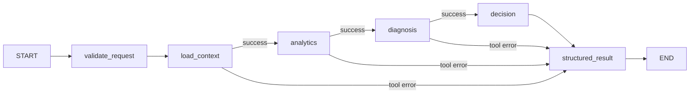

# System B Agent Foundation — Phase 4A

Phase 4A是结构化、确定性执行基础，Agent自身没有LLM、Prompt、意图分类、模型选工具、前端或长期memory。Phase 4B在其外侧新增[自然语言Copilot](copilot.md)，复用本页四工具及Graph，不改变业务执行层。

## Why LLM does not own business truth

System A → Adapter → Canonical/Analytics → Diagnosis → Decision → Agent。Analytics拥有公式，Diagnosis拥有原因规则，Decision拥有动作规则；Agent只调用已有入口、传播状态、保存单次执行的引用和编排trace。Agent中没有采购公式、原因谓词、消费阈值或新增动作映射。输入仅支持ANALYZE_OVERDUE_PO。

## Dependency decision

核验环境为Python 3.12.0、Pydantic 2.13.4、FastAPI 0.141.1。选择官方稳定 [langgraph 1.2.11](https://pypi.org/project/langgraph/1.2.11/)（Python>=3.10）；采用 [StateGraph API](https://docs.langchain.com/oss/python/langgraph/graph-api)，不需要模型即可运行。现有直接依赖版本不变，新增依赖与解析出的传递依赖全部固定在`backend/requirements.txt`。

主要传递依赖为langchain-core 1.6.1、langgraph-checkpoint 4.2.0、langgraph-prebuilt 1.1.0、langgraph-sdk 0.4.4、langsmith 0.11.2；它们是LangGraph依赖闭包，不代表启用托管服务。SDK约束使原未固定的websockets 17.0解析为16.1.1，现已显式固定；uvicorn仍兼容。Phase 4A没有模型SDK、向量数据库或RAG；Phase 4B的OpenAI依赖仅由外层Copilot使用。

`pip check`核验依赖一致性。入口以`tracing_context(enabled=False, parent=False)`关闭外部tracing，且不接受外部Runnable callbacks/config；即使环境开启LangSmith tracing也不会发送数据。没有配置checkpointer、store、retry、SaaS或模型客户端。

## Tool boundary

`agent/models.py`为公共Pydantic契约：frozen、extra=forbid；`TOOL_CONTRACTS`显式声明四个稳定名字、input/output schema和version=1.0.0。`agent/tools.py`只包装现有Adapter/Engine。

| Tool | Input | Output | Existing implementation |
|---|---|---|---|
| get_overdue_po_context | ContextRequest：request UUID、dataset UUID、snapshot date、schedule UUID | ContextOutput：ResolvedIdentity、context_ref、missing_sources | Adapter六路GET；R3/R5完整分页；R6 order-date查询 |
| get_overdue_po_analytics | AnalyticsInput：完整稳定identity、context_ref | AnalyticsOutput：AnalyticsEvidence、missing_evidence | assemble_evidence调用现有Analytics |
| diagnose_overdue_po | DiagnosisInput：identity、context_ref、显式可选Diagnosis Policy | DiagnosisOutput：状态/primary rule/version、信号、评估、缺证据/规则缺口、Policy全文/指纹、trace_ref | diagnose_business |
| get_procurement_decision | DecisionInput：identity、context_ref、diagnosis_ref、显式可选Decision Policy | DecisionOutput：状态、规则、动作、owner、checks、消费月数、Policy/指纹、未决需求及trace refs | decide |

每个Tool返回`ToolResult[T]`，SUCCESS对应typed output，ERROR对应AgentIssue；不返回自由文本，不透传异常正文。业务UNRESOLVED属于成功调用得到的业务结果，不伪装成工具异常。缺Policy不默认注入企业参数。

AgentTools是单次执行session，持有Canonical输入、EvidenceBundle及原始诊断/决策工件。Context和诊断引用包含request UUID与内容hash；不允许换身份、串用引用或把旧Policy诊断引用用于新工件。重复读取同一Context复用本次快照，不再次请求上游。新任务必须新session；它不是长期memory或持久化存储。调用顺序不满足时返回EVIDENCE_INCOMPLETE。

## Identity and retrieval

Request显式指定dataset/snapshot/schedule，先取唯一R1，再解析header、line、material、organization、supplier UUID。缺稳定身份即停止，不能用编码补Join。其它查询使用material UUID；R3还使用schedule UUID，R6使用PO.order_date。所有页（包括空页）必须与Request dataset/snapshot一致；多页失败不会发布半个context，R2/R4/R6意外多行不会随意取第一行。

成功空R2/R3/R4/R5保留为缺证据，不造0；空R6必须保留实际上游stockpile_selection语义。HTTP失败不是“无记录”，整个检索失败并停止业务节点。完整证据的跨源/时间验证继续由既有Assembler执行；Agent不修改选择规则或原始事实。

## State and graph

`agent/state.py`使用TypedDict，字段为typed request、context身份/引用、selected_tool、analytics/diagnosis/decision投影、errors、execution_trace和最终result。原始报表、Canonical输入与完整EvidenceBundle不作为节点state传递；没有message history。单次执行结束时才导出一次证据事实目录，不在每个节点复制。



公共入口`ProcurementAgent(adapter).execute(request)`先重新验证Request，再建立本次私有Graph/session。Schema损坏在进入Graph前返回INVALID_REQUEST，不回显未验证请求。Graph只有六个节点，不用模型选路；内部factory不作为外部调用接口。

NOT_COMPUTABLE指标不会被Graph统一解释为“不能诊断”：试产可以没有Forecast。Diagnosis自己决定证据是否足够。NOT_ELIGIBLE仍交Decision得到NOT_APPLICABLE；UNRESOLVED仍交Decision得到NOT_EVALUABLE，无动作。客户/内部相同primary reason分支保留原Decision结果，Graph不重新做映射。

## Response, errors and unresolved state

AgentExecutionResult含schema_version、status、原validated request、resolved_identity、Analytics/Diagnosis/Decision投影、execution_trace、issues、unresolved_requirements和provenance。

| Execution status | Meaning |
|---|---|
| COMPLETED | Decision DECIDED；可含明确非阻断角色缺口或可选源缺失 |
| NOT_APPLICABLE | Decision NOT_APPLICABLE |
| UNRESOLVED | Decision NOT_EVALUABLE；保留原缺参、缺证据、DC-16等需求 |
| FAILED | 请求/工具/框架错误，中断后续业务调用 |

AgentIssue区分INVALID_REQUEST、ENTITY_NOT_FOUND、UPSTREAM_UNAVAILABLE、UPSTREAM_REJECTED、UPSTREAM_INVALID_RESPONSE、EVIDENCE_INCOMPLETE、BUSINESS_UNRESOLVED、INTERNAL_TOOL_FAILURE。只有UPSTREAM_UNAVAILABLE标记可重试，但不自动重试。异常内容和原始HTTP正文均不导出；成功返回的可选源缺失使用非阻断EVIDENCE_INCOMPLETE，原因/动作仍由既有引擎决定。

## Trace chain

每条ExecutionTrace记录确定性sequence、node/tool、输入identity、result_status、selected_path及downstream_trace_ref。不记录真实时钟、随机run ID或自由文本答案。

Agent trace → DecisionOutput.trace_ref → source_diagnosis_ref → DiagnosisOutput及其规则/Policy评估 → provenance.facts。证据事实及derived_from闭包只导出一次；动作evidence_refs与诊断评估used_evidence_ids均可在目录中定位。Context引用代表本次加载工件，不是在线URL；本阶段没有外部工件存储或跨执行引用查询。hash用于内容关联，不宣称对不受信调用者的签名认证。

## Read-only guarantee

Agent自身唯一远程访问经已有SystemAAdapter GET实现。没有DB依赖、写接口、邮件、供应商联络、Cancel/Reschedule执行函数。Decision中的动作始终是recommendation。每次execute创建独立session/graph，调用者管理Adapter生命周期；没有全局业务状态或共享长期缓存。

## Usage

调用者先从公开契约取得实际稳定ID和snapshot，并明确提供业务Policy；不预置企业阈值。示例中的参数由调用者提供：

```python
from app.system_b.agent.models import AgentRequest
from app.system_b.agent.graph import ProcurementAgent

request = AgentRequest(
    request_id=request_id,
    dataset_version_id=dataset_id,
    snapshot_date=snapshot_date,
    po_line_schedule_id=schedule_id,
    diagnosis_policy=diagnosis_policy,
    decision_policy=decision_policy,
)
result = ProcurementAgent(adapter).execute(request)
```

## Current limitations and verification

- Agent自身不支持自然语言或展示字段消歧，仍要求dataset/snapshot/schedule；Phase 4B外层负责严格Intent、精确resolve与受控中文回答。没有最终UI。
- R1使用既有overdue-pos报表，不是任意历史PO实体目录；查不到时不猜是不存在还是未进入该报表。
- 不补上游契约、诊断参数权威值、售后/零需求处置缺口；不选择previous/current或改业务规则。
- Graph/session仅单次执行；无持久化checkpoint、长期memory、跨执行工件服务或服务端认证。Phase 4B另有一个本地Copilot API，不增加Agent内部接口。
- 两组Agent测试分别覆盖四个Tool和真实LangGraph：六路径Golden、same-primary不同动作、缺证据/参数、未决/不适用、GET/稳定筛选、完整分页、错误中断、trace、确定性、并发隔离及关闭外部tracing。测试无真实LLM、网络或System A服务依赖。

在backend运行`python -m pytest tests/test_system_b_agent_tools.py tests/test_system_b_agent_graph.py -q`；回归继续覆盖所有既有业务层。
