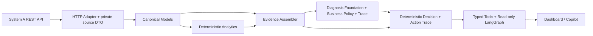

# System B — Phase 0 through Phase 4A

已实现REST Adapter、Canonical Models、确定性Analytics和公开证据契约。Phase 2A/2B建立Diagnosis框架与policy；Phase 2C补齐六个参数化分支，覆盖原五类原因。Phase 3新增只读Decision映射，售后处置仍因DC-16未决。Phase 4A增加typed Tool与无LLM的LangGraph结构化编排。未开发业务前端；不修改System A、Generator、数据库或已有业务公式/规则。

## Repository inspection

现有 Python 工程是 `backend/app`，依赖固定于 `backend/requirements.txt`，使用 Python 3.12、Pydantic 2、pydantic-settings、httpx、pytest。继续复用服务栈；Phase 4A仅增加LangGraph及其必要依赖闭包。

| 检查项 | 实际位置与结论 |
|---|---|
| FastAPI | `backend/app/main.py` 注册 health、datasets、reports；默认前缀 `/api/v1` |
| 六报表 | `backend/app/api/reports.py`；均为 GET 分页列表；实际路径见数据契约 |
| Dataset | `backend/app/api/datasets.py` 提供列表与按 UUID 查询；列表包含各状态 |
| DTO | `backend/app/schemas/reports.py` 从 Manifest 创建六个 Item，多数字段为可空 `Any`，不能作为 B 的强类型领域契约 |
| 字段投影 | `_public_row`保留既有展示列及独立证据白名单；R4增加周/项目周数组，R6增加历史选择元数据 |
| SQLAlchemy | `backend/app/models/platform/`：procurement、relationships、world_relationships、forecasts、operational 等；Material → MPM 是物料关系 |
| Migration | 001–011不变；012补五个窄证据视图，现有内部ID穿过REST投影，不开放raw表 |
| 测试 | `backend/tests/test_report_api.py` 覆盖六路由、分页、过滤、真实 API 角色与 OpenAPI 防泄漏；这些测试需要专用 PostgreSQL |
| 配置 | `backend/app/core/config.py` 与根目录 `.env.example`；复用 Settings 增加 B 的 HTTP 参数 |
| Docker | `docker-compose.dev.yml` 是 PostgreSQL 本地运行入口；根 compose 仍是早期骨架，缺容器 API DB 配置；本次不修改 |
| Frontend | 现有 Next.js 页面只是占位；顶层`agent/`仍保留，当前编排在`backend/app/system_b/agent/` |

早期 `ARCHITECTURE_API.md` §7 中的单物料路径、嵌套返回和 as-of 参数不等于已实现 REST。以实际 route / schema / public projection 为本阶段适配依据；差异记录在 [data-contracts.md](data-contracts.md)，不覆盖或悄悄修改原业务规格。

## Boundary and dependency direction



代码放在 `backend/app/system_b/`，不是改造 System A 的 `domain/` 或 `services/`。已有 `app/adapters/` 仍是空骨架；使用 B 命名空间避免 System A 公共进程反向依赖 B。模块可以独立通过 HTTP 调用另一进程中的 A，无数据库连接、Repository、ORM、Generator 或隐藏答案依赖。

- `models.py`：只依赖 Pydantic 和标准库，提供明确类型、不可变对象和分页上下文。保留来源粒度，不做合并、聚合或推断。
- `adapters/dto.py`：私有消费端 DTO，仅声明本阶段消费的字段，隔离上游宽报表。忽略未消费字段且不透传，消费字段缺失或类型不符则失败。
- `adapters/mapping.py`：只做字段重命名、结构重排；13 个周槽位转为 13 个 week index；不计算日期、Forecast 变化、盈余或任何采购判断。
- `adapters/system_a.py`：同步 httpx Client，显式 dataset UUID，分页 GET，timeout、状态码和响应校验；支持 MockTransport 注入及 context manager 关闭连接。
- `adapters/errors.py`：typed upstream errors，不将失败当作空数据，不记录原响应、URL 凭证或 validation input。
- 配置继续使用 `app.core.config.Settings`。System A 启动无需提供 B 的 URL；创建 Adapter 时才要求配置有效 URL。

`analytics/models.py` 提供轻量分组指标状态；`analytics/calculations.py` 实现显式日期的年龄/阈值、完整13周聚合、消耗、源供需盈余、库存覆盖和条件成立的显式同月 Forecast 比较。`analytics/service.py` 只编排这些纯函数，接收 canonical 对象，不导入 Adapter、httpx、Settings 或数据库。没有新增 Analytics endpoint。

同一 R4 行的物料级消耗和库存覆盖可直接计算；PO 与 Forecast 跨记录计算要求稳定 ID，不能退回名称 Join。confirmed/planned 供应口径、金额、Top 3 与自动版本比较等仍 blocked，不能因增加计算函数而宣称上游数据缺口已解决。完整公式、单位、availability 和依赖见 [analytics-metrics.md](analytics-metrics.md)。

Phase 1C通过真实REST补齐R1/R4身份、R3版本/项目、R4项目周事实和R6历史选择；解除原身份阻塞。Phase 2C按现有R3位置/horizon验证完整窗口，按R4数量贡献排名，但不扩展任意Anchor、完整版本目录或金额exposure。证据边界见 [evidence-contracts.md](evidence-contracts.md)。

`diagnosis/models.py` 定义Evidence Bundle、provenance及三态结果；`diagnosis/assembler.py`核验身份/时间并调用已有Analytics；`diagnosis/rules.py`提供Protocol和三个固定顺序基础规则；`diagnosis/engine.py`校验血缘、执行规则并返回所用证据及来源。无HTTP、DB、URL、clock或SDK依赖，也不新增endpoint。

Phase 2A只判断阈值资格、历史囤料记录存在和可比较Forecast负向变化；这些是支持信号，`primary_reason`始终为空。completeness仅针对所选规则要求。当前lifecycle不满足历史lifecycle要求；参考项目和项目周贡献不成为责任归属。接口、查询范围信任边界及缺失语义见 [diagnosis-engine.md](diagnosis-engine.md)。

Phase 2B新增`diagnosis/business_models.py`、`business_rules.py`、`policy.py`；Phase 2C增加`parameters.py`，由调用者提供独立版本化BusinessDiagnosisPolicy。原`diagnose`保持foundation兼容；`diagnose_business(bundle, policy)`可选择六分支唯一主原因。TRIAL仍由R1组织决定；其它分支使用唯一top项目、对应CURRENT_STATE、显式阈值及严格高优先级排除。参数全文/fingerprint与used_policy_fields进入结果。完整条件见 [diagnosis-rule-specification.md](diagnosis-rule-specification.md)。

`analytics/evidence_metrics.py`只做数量贡献聚合、共同月份比较及后移数量匹配；不读取Policy、不输出原因。Assembler消费`forecast_history`，保留R3完整版本/月事实和派生来源。项目并列/全零、缺Policy/月份或lifecycle身份不对应时不猜值、不归责。六个分支已可执行，但诊断企业参数权威值仍须调用者明确提供。自然语言交互/前端仍未实现；任何层都不得绕过REST读取A的隐藏答案。

`decision/models.py`、`rules.py`、`engine.py`消费BusinessDiagnosisResult+EvidenceBundle，按主原因/规则ID/版本匹配六个处置入口。实际五种动作源于已固化规格；消费分支使用显式选择的正式6个月Policy，售后DC-16无动作。客户与内部呆滞分别沟通客户/事业部；MPM仅按物料关联。核验证据派生但不重新诊断，不调用HTTP/DB、不执行操作。输入、动作、缺口及trace见 [decision-engine.md](decision-engine.md)，逐条来源见 [decision-rule-specification.md](decision-rule-specification.md)。

`agent/models.py`定义结构化Request/Tool/Response；`tools.py`通过Adapter加载同dataset/snapshot的稳定ID证据，再调用已有Assembler、Diagnosis和Decision；`state.py`只传投影/引用；`graph.py`以六个确定性节点编排，工具失败即停止后续业务调用。没有业务公式或动作规则复制，原始工件仅在单次session保留，最终证据目录只导出一次。依赖固定LangGraph 1.2.11，关闭外部tracing且无checkpointer；不接LLM、模型SDK、DB或写操作。详见 [agent-architecture.md](agent-architecture.md)。

## Operational contract

每次查询必须传 `dataset_version_id`，不隐式选择 latest。调用者可用 `list_datasets()` 发现候选，再用 `get_dataset(id)` 检查状态和 hash；本阶段允许显式读取开发 dataset，与 A 行为一致，不声称它不可变。每个返回行都携带同一 dataset UUID 与 snapshot date，跨页还需调用者核验或使用 `iter_pages()` 的一致性检查。

单页方法返回 `CanonicalPage[T]`，绝不把一页冒充全部结果。`iter_pages()` 从第一页拉取，验证 dataset、snapshot、total 与分页连贯性；异常终止，已 yield 页不能当作完整结果。它是惰性传输迭代器，不做业务分析。

默认每个 HTTP timeout 阶段 10 秒，可配置；不自动重试、不跟随 redirect、不继承代理环境。非 200（包括 3xx/204）显式错误。404、timeout/网络故障/5xx、其他 HTTP 状态、响应校验有不同异常类型。服务端错误 detail 不向外透传。没有部署 B 的路由、认证、缓存、消息发送或定时任务。

## Usage

在 backend 工作目录，设置 `.env` 中的 `SYSTEM_A_BASE_URL` 为含 `/api/v1` 的 HTTP 地址：

```python
from uuid import UUID
from app.system_b.adapters.system_a import SystemAAdapter

dataset_id = UUID("1d533913-115a-5f95-a865-374640fb05fc")  # replace with an actual dataset ID
with SystemAAdapter() as adapter:
    dataset = adapter.get_dataset(dataset_id)
    page = adapter.purchase_orders(dataset_id, page_size=100)
    for batch in adapter.iter_pages(adapter.forecast_history, dataset_id, material_code="MAT-EXAMPLE"):
        for forecast in batch.items:
            print(forecast.forecast_month, forecast.forecast_qty)
```

示例 ID/编码仅示意；真实值来自 Dataset API 和当前公开报表。禁止按名称猜 UUID。稳定 Join、历史囤料查询使用 Phase 1C 证据契约；完整预测窗口的自动选择仍未实现。获取 canonical 对象后可调用 AnalyticsService 或 Diagnosis Evidence Assembler；示例分别见指标和诊断文档。

## Verification

`python -m pytest tests/test_system_b_adapter.py` 无需真实 HTTP 服务或数据库。测试通过 MockTransport 和 FastAPI dependency override 验证错误语义、类型、分页、映射、防泄漏和实际路由兼容。全量回归使用 `python -m pytest`；无专用测试数据库时 PostgreSQL 用例按既有规则 skip，不能把它描述为完整数据库验收。

`python -m pytest tests/test_system_b_analytics.py` 额外验证纯指标、固定日期边界、零/缺失/非法数量、不完整 horizon、版本比较条件与无 HTTP/clock 依赖。Analytics 不产生诊断或采购动作。

`python -m pytest tests/test_system_b_diagnosis.py` 验证纯Diagnosis Foundation的规则三态、身份/时间拒绝、provenance、历史lifecycle和参考项目红线，以及确定性。它不依赖真实System A或数据库。

`python -m pytest tests/test_system_b_business_diagnosis.py` 验证TRIAL Golden scenarios、业务policy、未知排除项、阈值资格与来源；测试不导入Generator阈值或隐藏答案。

`python -m pytest tests/test_system_b_diagnosis_completion.py` 验证六分支Golden正例/排除、显式参数、项目并列、完整Anchor窗口、缺证据保护及参数/事实provenance。

`python -m pytest tests/test_system_b_decision.py` 验证六路径动作、6个月边界、缺证据/参数、售后规格阻断、不同主规则同原因、trace、防串用与确定性。

`python -m pytest tests/test_system_b_agent_tools.py tests/test_system_b_agent_graph.py` 验证工具schema/错误、真实LangGraph路径、只读GET、引用、缺证据保护、状态隔离与无外部tracing。没有真实LLM测试依赖。
