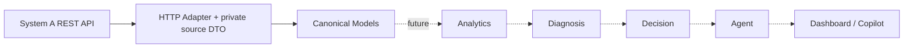

# System B — Phase 0 / Phase 1A

本阶段实现 REST Adapter 和 Canonical Models；不实现 Analytics、Diagnosis、Decision、Agent 或业务前端。System A 的数据生成、数据库角色、迁移和业务公式保持不变。

## Repository inspection

现有 Python 工程是 `backend/app`，依赖固定于 `backend/requirements.txt`，使用 Python 3.12、Pydantic 2、pydantic-settings、httpx、pytest。继续复用，不新建服务栈或引入依赖。

| 检查项 | 实际位置与结论 |
|---|---|
| FastAPI | `backend/app/main.py` 注册 health、datasets、reports；默认前缀 `/api/v1` |
| 六报表 | `backend/app/api/reports.py`；均为 GET 分页列表；实际路径见数据契约 |
| Dataset | `backend/app/api/datasets.py` 提供列表与按 UUID 查询；列表包含各状态 |
| DTO | `backend/app/schemas/reports.py` 从 Manifest 创建六个 Item，多数字段为可空 `Any`，不能作为 B 的强类型领域契约 |
| 字段投影 | `backend/app/services/report_queries.py::_public_row` 只保留展示列；R3 额外保留 schedule ID、月份、数量和窗口角色 |
| SQLAlchemy | `backend/app/models/platform/`：procurement、relationships、world_relationships、forecasts、operational 等；Material → MPM 是物料关系 |
| Migration | `backend/alembic/versions/001` 至 `011`；内部 View 有稳定 ID，但多数没有穿过 REST 投影 |
| 测试 | `backend/tests/test_report_api.py` 覆盖六路由、分页、过滤、真实 API 角色与 OpenAPI 防泄漏；这些测试需要专用 PostgreSQL |
| 配置 | `backend/app/core/config.py` 与根目录 `.env.example`；复用 Settings 增加 B 的 HTTP 参数 |
| Docker | `docker-compose.dev.yml` 是 PostgreSQL 本地运行入口；根 compose 仍是早期骨架，缺容器 API DB 配置；本次不修改 |
| Frontend | 现有 Next.js 页面只是占位；`agent/` 保留目录，不进入本阶段 |

早期 `ARCHITECTURE_API.md` §7 中的单物料路径、嵌套返回和 as-of 参数不等于已实现 REST。以实际 route / schema / public projection 为本阶段适配依据；差异记录在 [data-contracts.md](data-contracts.md)，不覆盖或悄悄修改原业务规格。

## Boundary and dependency direction



代码放在 `backend/app/system_b/`，不是改造 System A 的 `domain/` 或 `services/`。已有 `app/adapters/` 仍是空骨架；使用 B 命名空间避免 System A 公共进程反向依赖 B。模块可以独立通过 HTTP 调用另一进程中的 A，无数据库连接、Repository、ORM、Generator 或隐藏答案依赖。

- `models.py`：只依赖 Pydantic 和标准库，提供明确类型、不可变对象和分页上下文。保留来源粒度，不做合并、聚合或推断。
- `adapters/dto.py`：私有消费端 DTO，仅声明本阶段消费的字段，隔离上游宽报表。忽略未消费字段且不透传，消费字段缺失或类型不符则失败。
- `adapters/mapping.py`：只做字段重命名、结构重排；13 个周槽位转为 13 个 week index；不计算日期、Forecast 变化、盈余或任何采购判断。
- `adapters/system_a.py`：同步 httpx Client，显式 dataset UUID，分页 GET，timeout、状态码和响应校验；支持 MockTransport 注入及 context manager 关闭连接。
- `adapters/errors.py`：typed upstream errors，不将失败当作空数据，不记录原响应、URL 凭证或 validation input。
- 配置继续使用 `app.core.config.Settings`。System A 启动无需提供 B 的 URL；创建 Adapter 时才要求配置有效 URL。

未来 Analytics 才计算年龄、阈值、超期金额、需求变动、消耗与覆盖；Diagnosis 执行已确认的判断顺序和五类原因；Decision 将证据和责任路径映射到已确认对策；Agent 编排工具及解释结果；Frontend 展示证据与结果。任何未来功能都不得绕过 REST 直接读取 A 的数据库或隐藏答案。

## Operational contract

每次查询必须传 `dataset_version_id`，不隐式选择 latest。调用者可用 `list_datasets()` 发现候选，再用 `get_dataset(id)` 检查状态和 hash；本阶段允许显式读取开发 dataset，与 A 行为一致，不声称它不可变。每个返回行都携带同一 dataset UUID 与 snapshot date，跨页还需调用者核验或使用 `iter_pages()` 的一致性检查。

单页方法返回 `CanonicalPage[T]`，绝不把一页冒充全部结果。`iter_pages()` 从第一页拉取，验证 dataset、snapshot、total 与分页连贯性；异常终止，已 yield 页不能当作完整结果。它是惰性传输迭代器，不做业务分析。

默认每个 HTTP timeout 阶段 10 秒，可配置；不自动重试、不跟随 redirect、不继承代理环境。非 200（包括 3xx/204）显式错误。404、timeout/网络故障/5xx、其他 HTTP 状态、响应校验有不同异常类型。服务端错误 detail 不向外透传。没有部署 B 的路由、认证、缓存、消息发送或定时任务。

## Usage

在 backend 工作目录，设置 `.env` 中的 `SYSTEM_A_BASE_URL` 为含 `/api/v1` 的 HTTP 地址：

```python
from uuid import UUID
from app.system_b.adapters.system_a import SystemAAdapter

dataset_id = UUID("1d533913-115a-5f95-a865-374640fb05fc")  # replace with an actual dataset ID
with SystemAAdapter() as adapter:
    dataset = adapter.get_dataset(dataset_id)
    page = adapter.purchase_orders(dataset_id, page_size=100)
    for batch in adapter.iter_pages(adapter.forecast_history, dataset_id, material_code="MAT-EXAMPLE"):
        for forecast in batch.items:
            print(forecast.forecast_month, forecast.forecast_qty)
```

示例 ID/编码仅示意；真实值来自 Dataset API 和当前公开报表。禁止按名称猜 UUID。后续稳定 Join、历史囤料和完整预测比较必须先解决合同缺口。

## Verification

`python -m pytest tests/test_system_b_adapter.py` 无需真实 HTTP 服务或数据库。测试通过 MockTransport 和 FastAPI dependency override 验证错误语义、类型、分页、映射、防泄漏和实际路由兼容。全量回归使用 `python -m pytest`；无专用测试数据库时 PostgreSQL 用例按既有规则 skip，不能把它描述为完整数据库验收。
